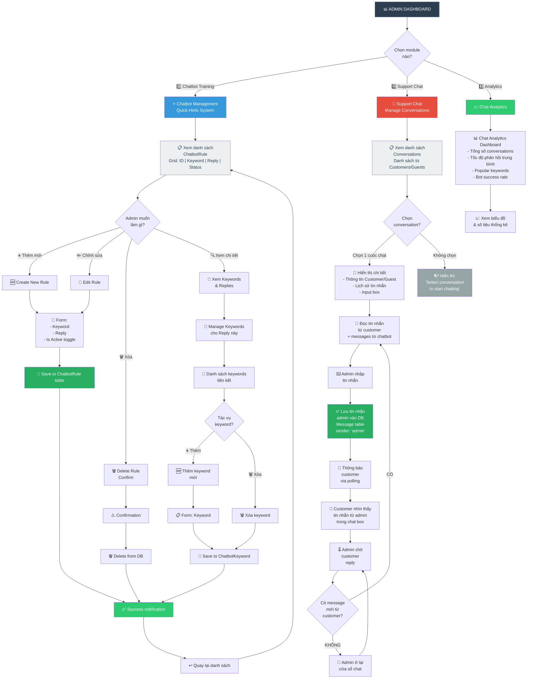

# 🛠️ Admin Dashboard - Chatbot & Support Management

## 📋 Using this code:

1. Go to **https://mermaid.live**
2. Paste the code below
3. Or convert via **https://mermaid.ink/**

---



---

## 📌 Admin Dashboard Structure

### Main Menu
- ⭐ **Chatbot Training** (Quick Hints Management)
- 💬 **Support Chat** (Live Conversations)
- 📈 **Analytics** (Performance Metrics)

---

## ⭐ Module 1: Chatbot Training

### 1.1 - View Chatbot Rules List

**Location**: `/admin/chatbot`

**Grid Columns**:
| ID | Keyword | Reply | Status | Actions |
|---|---------|-------|--------|---------|
| 1 | shipping cost | Free for $30+ | Active | ✏️ 🗑️ |
| 2 | return policy | 30 days | Active | ✏️ 🗑️ |
| 3 | track order | Check email | Inactive | ✏️ 🗑️ |

**Features**:
- ✅ Pagination (15 items/page)
- ✅ Search filter by keyword
- ✅ Sort by date, status
- ✅ Bulk actions (activate/deactivate)
- ✅ Quick edit inline

---

### 1.2 - Create New Rule

**Form Fields**:
```
┌─────────────────────────────────────┐
│ Chatbot Training - Add New Rule     │
├─────────────────────────────────────┤
│                                     │
│ Keyword *                           │
│ ┌─────────────────────────────────┐ │
│ │ shipping cost                   │ │
│ └─────────────────────────────────┘ │
│                                     │
│ Reply *                             │
│ ┌─────────────────────────────────┐ │
│ │ Free shipping for orders over   │ │
│ │ $30! Enter code SHIP30           │ │
│ └─────────────────────────────────┘ │
│                                     │
│ ☑ Active (toggle)                   │
│                                     │
│ [Cancel] [Create Rule]              │
└─────────────────────────────────────┘
```

**Validation**:
- ✅ Keyword required & unique
- ✅ Reply required (max 1000 chars)
- ✅ Is_active default = true
- ✅ Suggest similar keywords

---

### 1.3 - Edit Rule

Same form as Create, pre-filled with existing data.

**On Save**:
```php
$rule->update([
    'keyword' => $keyword,
    'reply' => $reply,
    'is_active' => $isActive
]);
```

---

### 1.4 - Delete Rule

**Confirmation Modal**:
```
┌────────────────────────────────┐
│ ⚠️  Delete Chat Rule?          │
├────────────────────────────────┤
│                                │
│ Are you sure you want to delete│
│ this rule?                     │
│                                │
│ Keyword: "shipping cost"       │
│                                │
│ This action cannot be undone.  │
│                                │
│ [Cancel] [Delete]              │
└────────────────────────────────┘
```

---

### 1.5 - Manage Keywords (Optional Feature)

**If you decide to split keywords from rules later**:

**View Keywords for a Rule**:
```
ChatbotReply: "Free shipping for $30+"
├── Keywords:
│   ├── "shipping cost"
│   ├── "free shipping"
│   ├── "shipping charge"
│   └── "delivery fee"
```

**Add/Delete Keywords**:
```
📝 Add New Keyword
┌──────────────────────┐
│ shipping fee         │ [Add] [Cancel]
└──────────────────────┘
```

---

## 💬 Module 2: Support Chat

### 2.1 - Conversations List

**Location**: `/admin/chat`

**Left Sidebar (Conversations)**:
```
┌──────────────────────────────┐
│ Conversations                │
├──────────────────────────────┤
│ 👤 John Doe              │5  │
│ ❌ Chat: Need return...      │
│                              │
│ 👤 Sarah (Guest)        │ 2  │
│ ✅ Answered: FAQ shipping    │
│                              │
│ 👤 Mike Wilson          │12  │
│ 💬 Open: Product question    │
│                              │
└──────────────────────────────┘
```

**Badge Meanings**:
- 🔴 Red = Unread/Urgent
- 🟡 Yellow = Waiting for admin reply
- 🟢 Green = Resolved

---

### 2.2 - Chat Window (Main Area)

**Layout**:
```
┌────────────────────────────────────────┐
│ 👤 John Doe | john@email.com   ✕       │ ← Header
├────────────────────────────────────────┤
│                                        │
│ System: Chat started                   │
│                                        │
│                        I want to return│ ← User msg
│                        my order placed │
│                        yesterday        │
│                                (14:32) │
│                                        │
│ 🤖 Sure! I can help with returns. Our │ ← Bot reply
│    return window is 30 days. What's    │
│    your order number?                  │
│                        (14:32)         │
│                                        │
│ My order is #12345           (14:35)  │
│                                        │
│ ✍️ Admin is typing...                   │
│                                        │
├────────────────────────────────────────┤
│ ┌────────────────────────────────────┐ │
│ │ Type your reply...                 │ │
│ └────────────────────────────────────┘ │
│                               📤        │
└────────────────────────────────────────┘
```

---

### 2.3 - Send Reply

**By Admin**:
```javascript
POST /admin/chat/{conversation}/reply
{
  "message": "Perfect! Let me check your order status. One moment..."
}
```

**Response**:
```json
{
  "success": true,
  "message": {
    "id": 156,
    "body": "Perfect! Let me check your order status...",
    "sender": "admin",
    "created_at": "2026-02-21T14:37:00"
  }
}
```

**Frontend Update**:
- ✅ Show admin message immediately
- ✅ Send via API to backend
- ✅ Save to Message table
- ✅ Notify customer via polling

---

## 📈 Module 3: Analytics Dashboard

### 3.1 - Key Metrics

```
┌────────────────────────────────────────┐
│ 📊 Chat Analytics               [Filter]│
├────────────────────────────────────────┤
│                                        │
│ ┌──────────────┐  ┌──────────────┐   │
│ │ Total Chats  │  │ Avg Response │   │
│ │     324      │  │   5.2 min    │   │
│ └──────────────┘  └──────────────┘   │
│                                        │
│ ┌──────────────┐  ┌──────────────┐   │
│ │ Bot Success  │  │ Customer     │   │
│ │   78.5%      │  │ Rating: 4.2⭐ │   │
│ └──────────────┘  └──────────────┘   │
│                                        │
├────────────────────────────────────────┤
│                                        │
│ 📈 Popular Questions (Last 7 days)    │
│                                        │
│ 1. Shipping cost        52 times ████  │
│ 2. Return policy       41 times ███░   │
│ 3. Track order         38 times ███░   │
│ 4. Discount codes      25 times ██░    │
│ 5. Product diff        18 times █░     │
│                                        │
└────────────────────────────────────────┘
```

### 3.2 - Charts

- **📊 Chat Volume** (Line chart by day)
- **⏱️ Response Time** (Avg minutes/day)
- **🎯 Success Rate** (% of resolved chats)
- **💬 Message Breakdown** (User/Bot/Admin %)

---

## 🔌 Admin API Endpoints

### GET `/admin/chat` - View conversations
```javascript
GET /admin/chat
GET /admin/chat?conversation_id=123
```

### POST `/admin/chat/{id}/reply` - Send message
```javascript
POST /admin/chat/123/reply
{
  "message": "Thank you for your message..."
}
```

### GET `/admin/chat/{id}/fetch` - Get messages
```javascript
GET /admin/chat/123/fetch?last_id=50
```

### GET `/admin/chatbot` - View rules
```javascript
GET /admin/chatbot
```

### POST `/admin/chatbot` - Create rule
```javascript
POST /admin/chatbot
{
  "keyword": "shipping",
  "reply": "Free shipping for $30+",
  "is_active": true
}
```

### PUT `/admin/chatbot/{id}` - Update rule
```javascript
PUT /admin/chatbot/1
{
  "keyword": "shipping cost",
  "reply": "Updated reply text",
  "is_active": true
}
```

### DELETE `/admin/chatbot/{id}` - Delete rule
```javascript
DELETE /admin/chatbot/1
```

---

## 📋 Routes Reference

```php
// routes/admin.php

Route::resource('chatbot', ChatbotController::class)->except(['show']);
// Creates: GET, POST, PUT, DELETE /admin/chatbot

Route::resource('chatbot-replies', ChatbotReplyController::class);
// Optional: For managing replies separately if needed

Route::controller(AdminChatController::class)
    ->prefix('chat')
    ->name('chat.')
    ->group(function () {
        Route::get('/', 'index')->name('index');
        Route::post('/{conversation}/reply', 'reply')->name('reply');
        Route::get('/{conversation}/fetch', 'fetchMessages')->name('fetch');
    });
```

---

## 💾 Controllers Reference

### [ChatbotController](../app/Http/Controllers/Admin/ChatbotController.php)
- `index()` - Show rules list
- `create()` - Show create form
- `store()` - Save new rule
- `edit()` - Show edit form
- `update()` - Update rule
- `destroy()` - Delete rule
- `getDataForGrid()` - Fetch data for GridJS table

### [AdminChatController](../app/Http/Controllers/Admin/ChatController.php)
- `index()` - Show conversations
- `reply()` - Send admin message
- `fetchMessages()` - Get new messages

---

## 🎨 Admin UI Technologies Used

- **GridJS** - For table rendering (chatbot rules)
- **Bootstrap** - For layout & styling
- **AJAX** - For real-time updates
- **Blade Templates** - Server-side rendering
- **TailwindCSS** - Additional styling

