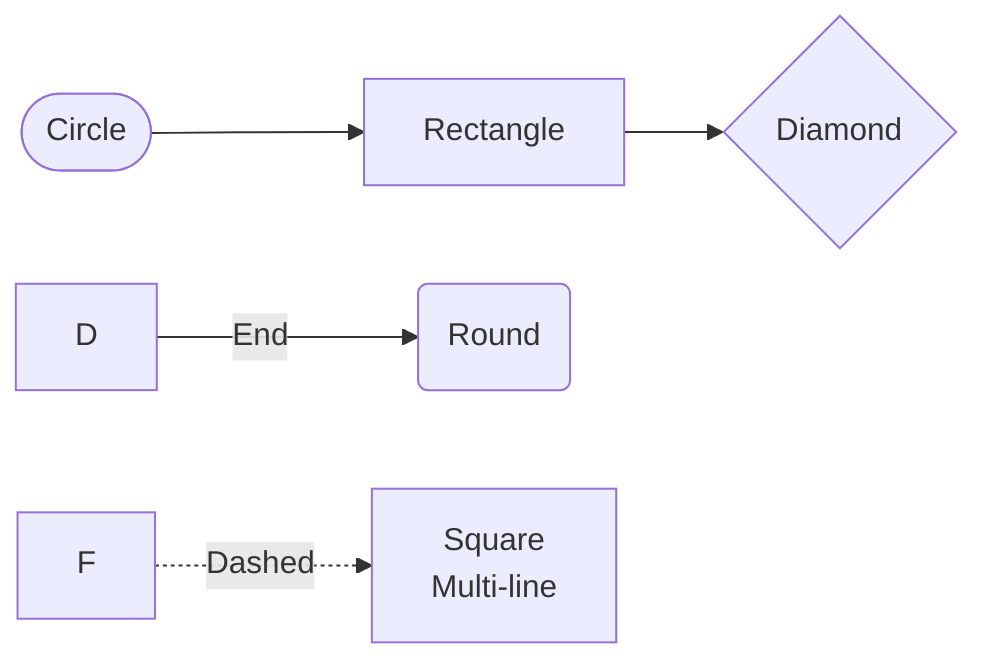

# 🎯 Chat System - Complete Flowchart Collection

## 📚 What's Included?

This package contains **4 comprehensive flowcharts** for your Chat Bot & Support Chat system:

| File | Type | Purpose | Best For |
|------|------|---------|----------|
| `CHATBOT_FLOWCHART_CLIENT_JOURNEY.md` | Flowchart | User interaction flow | Understanding user behavior |
| `CHATBOT_FLOWCHART_WIDGET_STATES.md` | State Diagram | UI states & components | Frontend development |
| `CHATBOT_FLOWCHART_API_SEQUENCE.md` | Sequence Diagram | API calls & timing | Backend integration |
| `CHATBOT_FLOWCHART_ADMIN_DASHBOARD.md` | Flowchart | Admin management | Admin panel design |

---

## 🚀 Quick Start Guide

### Option 1: View Online (Easiest)
1. **Go to**: https://mermaid.live
2. **Copy-paste** code from any `.md` file above
3. **View instantly** in browser
4. **Download** as PNG or SVG

### Option 2: Use in draw.io
1. **Go to**: https://draw.io
2. **File → Import → XML**
3. **Go to**: https://mermaid.ink/[encode-diagram]
4. **Copy SVG** → Paste in draw.io
5. **Edit** and customize

### Option 3: Use in GitHub
1. **Commit** these `.md` files to your repo
2. **GitHub renders** Mermaid diagrams automatically
3. **Click** the diagram image area to interact

### Option 4: Generate Images (CLI)
```bash
# Install mermaid-cli
npm install -g mermaid-cli

# Convert to PNG
mmdc -i CHATBOT_FLOWCHART_CLIENT_JOURNEY.md -o flowchart.png

# Convert to SVG
mmdc -i CHATBOT_FLOWCHART_CLIENT_JOURNEY.md -o flowchart.svg -t dark
```

---

## 📖 How to Use Each Flowchart

### 1️⃣ **Client Journey Flowchart**
📄 [CHATBOT_FLOWCHART_CLIENT_JOURNEY.md](CHATBOT_FLOWCHART_CLIENT_JOURNEY.md)

**Use when**:
- ✅ Designing frontend user experience
- ✅ Documenting user scenarios
- ✅ Planning JavaScript logic
- ✅ Presenting to stakeholders

**Key paths covered**:
- User opens website → Chat widget loads
- User selects quick hint → Auto-reply from bot
- User types message → Polling for admin reply
- Timeout handling → Default message + FAQ
- Edge cases → Offline, refresh, close tab

---

### 2️⃣ **Widget States & Components**
📄 [CHATBOT_FLOWCHART_WIDGET_STATES.md](CHATBOT_FLOWCHART_WIDGET_STATES.md)

**Use when**:
- ✅ Building React/Vue components
- ✅ Designing UI mockups
- ✅ Defining CSS styling
- ✅ Planning animations

**States explained**:
- 🔴 **CLOSED** - Icon + badge
- 🟢 **OPENING** - Zoom animation
- 🟠 **OPEN-NEW** - Greeting + suggestions
- 🟠 **OPEN-CHATTING** - Message history
- 🟡 **WAITING** - Typing indicator
- ⚫ **TIMEOUT** - Default message

**Components included**:
- Message bubbles (User/Bot/Admin)
- Quick hint buttons
- Input box & send button
- Typing indicators
- Widget layout structure

---

### 3️⃣ **API Sequence Diagram** ⭐ Recommended
📄 [CHATBOT_FLOWCHART_API_SEQUENCE.md](CHATBOT_FLOWCHART_API_SEQUENCE.md)

**Use when**:
- ✅ Documenting backend API calls
- ✅ Debugging timing issues
- ✅ Explaining to other developers
- ✅ Planning infrastructure

**API endpoints covered**:
- `GET /chat/suggestions` - Load suggestions
- `POST /chat/send` - Send message/quick hint
- `GET /chat/fetch` - Poll for new messages
- `POST /chat/default-message` - Timeout
- `POST /admin/chat/{id}/reply` - Admin reply

**Includes**:
- Request/response examples
- Polling strategy
- Timeout logic
- Error handling
- Security considerations

---

### 4️⃣ **Admin Dashboard Flowchart**
📄 [CHATBOT_FLOWCHART_ADMIN_DASHBOARD.md](CHATBOT_FLOWCHART_ADMIN_DASHBOARD.md)

**Use when**:
- ✅ Building admin interface
- ✅ Planning moderator workflows
- ✅ Documenting management features
- ✅ Training admins

**Three modules**:
1. **Chatbot Training** - Manage quick hints
   - View/Edit/Delete rules
   - Manage keywords
   - Toggle active status

2. **Support Chat** - Live conversations
   - View all conversations
   - Read message history
   - Send admin replies
   - Real-time notifications

3. **Analytics** - Performance metrics
   - Total chats count
   - Average response time
   - Bot success rate
   - Popular questions

---

## 🎨 Customization Tips

### For draw.io
1. **Colors**: Change `fill:#2196F3` to your brand colors
2. **Shapes**: Replace rectangles with your preferred shapes
3. **Icons**: Add emoji or vector icons
4. **Layout**: Use horizontal/vertical layout options
5. **Grouping**: Organize related nodes into subgraphs

### For Mermaid
```mermaid
%%{init: {'theme':'base', 'themeVariables': { 'primaryColor':'#2196F3'}}}%%
```

Add this at the top of any mermaid code to customize colors.

---

## 📋 Mermaid Syntax Quick Reference

### Basic Shapes


### Styling
```css
style NodeID fill:#color,stroke:#border,color:#text,stroke-width:2px
```

### Subgraphs
```mermaid
subgraph ID["Title"]
    A --> B
end
```

---

## 🔗 Integration with Your Project

### In Laravel Project
Place these files in your project root:
```
your-project/
├── CHATBOT_FLOWCHART_CLIENT_JOURNEY.md
├── CHATBOT_FLOWCHART_WIDGET_STATES.md
├── CHATBOT_FLOWCHART_API_SEQUENCE.md
├── CHATBOT_FLOWCHART_ADMIN_DASHBOARD.md
└── CHATBOT_FLOWCHART_GUIDE.md (this file)
```

### In README.md
```markdown
## Architecture Documentation

- [Client-Side User Journey](CHATBOT_FLOWCHART_CLIENT_JOURNEY.md)
- [Widget UI States](CHATBOT_FLOWCHART_WIDGET_STATES.md)
- [API Integration](CHATBOT_FLOWCHART_API_SEQUENCE.md)
- [Admin Dashboard](CHATBOT_FLOWCHART_ADMIN_DASHBOARD.md)
```

### In GitHub Wiki
Create a Wiki page and embed these diagrams:
```markdown

```

---

## 💡 Use Cases

### For Developers
- **Frontend**: Use Widget States + API Sequence
- **Backend**: Use API Sequence + Admin Dashboard
- **Debugging**: Use Client Journey + API Sequence

### For Designers
- **UI/UX**: Use Widget States + Client Journey
- **Prototyping**: Use Widget States
- **Handoff**: Use all 4 flowcharts

### For Project Managers
- **Planning**: Use Client Journey + Admin Dashboard
- **Documentation**: Use all 4 flowcharts
- **Stakeholder presentation**: Use Client Journey

### For QA/Testing
- **Test scenarios**: Use Client Journey
- **Edge cases**: Use Client Journey + API Sequence
- **Admin testing**: Use Admin Dashboard

---

## 🔄 How to Export

### PNG (High Quality)
```bash
mmdc -i diagram.md -o diagram.png -s 1.5
```

### SVG (Scalable)
```bash
mmdc -i diagram.md -o diagram.svg --theme dark
```

### PDF (Print-ready)
```bash
mmdc -i diagram.md -o diagram.pdf
```

---

## 📞 API Endpoints Summary

### **Frontend Routes** (Customer/Guest)
```
GET  /chat/suggestions           → Get quick hints
POST /chat/send                  → Send message
GET  /chat/fetch                 → Poll for replies
POST /chat/default-message       → Request default message
```

### **Admin Routes**
```
GET    /admin/chatbot            → View all rules
GET    /admin/chatbot/{id}/edit  → Edit form
POST   /admin/chatbot            → Create rule
PUT    /admin/chatbot/{id}       → Update rule
DELETE /admin/chatbot/{id}       → Delete rule

GET    /admin/chat               → View conversations
POST   /admin/chat/{id}/reply    → Send message
GET    /admin/chat/{id}/fetch    → Get messages
```

---

## ⚙️ Technical Stack Used

| Layer | Technology |
|-------|------------|
| **Backend** | Laravel 11 |
| **Frontend** | Vanilla JavaScript |
| **Database** | MySQL |
| **Chat Library** | Musonza/Chat |
| **Admin UI** | GridJS + Bootstrap |
| **Real-time** | Polling (or WebSockets) |
| **Forms** | Blade Templates |

---

## 📊 Database Schema Quick Reference

### Chatbot System
```
ChatbotRule
├── id
├── keyword
├── reply
└── is_active

ChatbotReply (optional)
├── id
├── topic
├── reply
└── is_active

ChatbotKeyword (optional)
├── id
├── chatbot_reply_id
└── keyword
```

### Support Chat System
```
Conversation
├── id
├── subject
├── created_at
└── updated_at

Participant (polymorphic)
├── id
├── conversation_id
├── messageable_id
├── messageable_type
└── last_read

Message
├── id
├── conversation_id
├── body
└── created_at
```

### Users
```
Customer
├── id
├── email
└── name

Guest
├── id
├── session_id
└── ip_address

User (Admin)
├── id
├── email
└── name
```

---

## 🎯 Next Steps

1. **Copy code** from markdown files
2. **Paste into** mermaid.live or draw.io
3. **Customize** colors/styles to match your brand
4. **Export** as PNG/SVG for documentation
5. **Share** with team for feedback
6. **Iterate** based on requirements

---

## 📝 File Locations

All files are located in your project root:
- 📍 `c:\wamp64\www\projects\mint_cosmetics\`

---

## 🆘 Troubleshooting

### "Diagram not rendering"
- ✅ Check syntax: `-->` for flows, `{Text}` for diamonds
- ✅ Clear browser cache
- ✅ Try incognito window

### "Can't convert to draw.io"
- ✅ Use https://mermaid.ink/ to convert first
- ✅ Export as SVG instead of PNG
- ✅ Use draw.io import feature

### "Lines overlapping"
- ✅ Add more intermediate nodes
- ✅ Use `graph LR` instead of `graph TD`
- ✅ Split into multiple diagrams

---

## 📚 Resources

- **Mermaid Docs**: https://mermaid.js.org/
- **Mermaid Live**: https://mermaid.live/
- **draw.io**: https://draw.io
- **Mermaid CLI**: https://github.com/mermaid-js/mermaid-cli

---

## ✅ Checklist

Before using these flowcharts:
- [ ] Review all 4 diagrams
- [ ] Share with team members
- [ ] Get feedback on logic flow
- [ ] Customize to your brand
- [ ] Export for documentation
- [ ] Link in README.md
- [ ] Add to GitHub Wiki
- [ ] Use in onboarding training

---

**Last Updated**: February 21, 2026  
**Created by**: GitHub Copilot  
**Project**: Mint Cosmetics Chat System  

