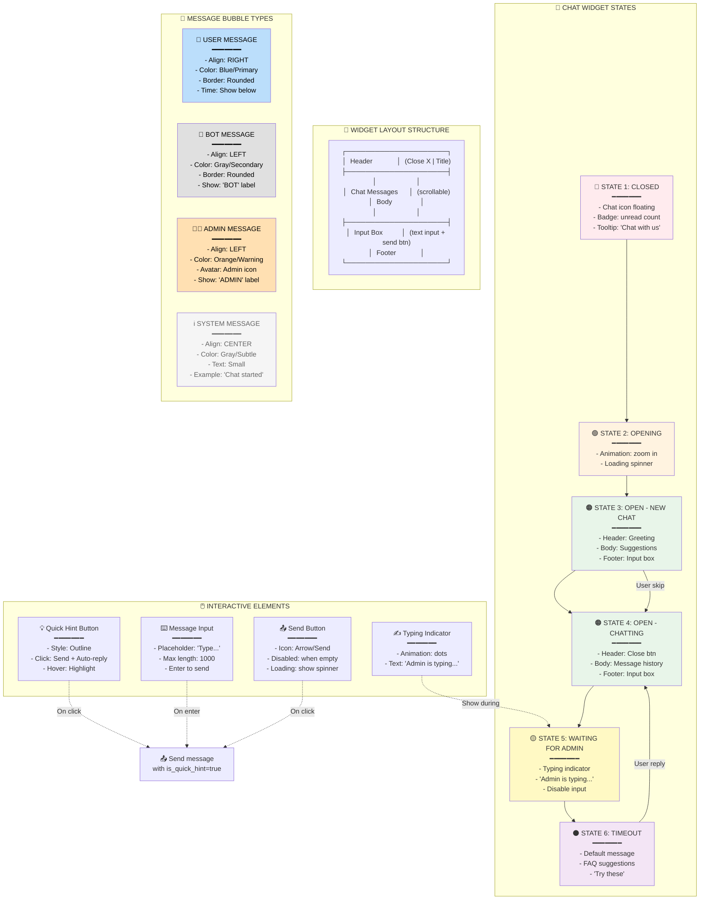

# 🎨 Chat Widget - UI States & Components

## 📋 Using this code:
1. Go to **https://mermaid.live**
2. Paste the code below
3. Download as PNG/SVG
4. Or use in draw.io by converting via **https://mermaid.ink/**

---



---

## 🎯 Widget States Explanation

### State 1: CLOSED 🔴
- Chat icon floating in bottom-right corner
- Badge showing unread message count
- Tooltip: "Chat with us" on hover
- **Click action**: Open to State 2

### State 2: OPENING 🟢
- Fade-in animation
- Loading spinner shown
- Brief duration (100-300ms)
- **Transition**: Goes to State 3

### State 3: OPEN - NEW CHAT 🟠
- Header: Greeting + chatbot intro
- Body: Quick Hints suggestions
- Footer: Message input box
- **User action**: 
  - Click suggestion → Send message
  - Skip suggestions → Type message
  - Both → Go to State 4

### State 4: OPEN - CHATTING 🟠
- Header: Close (X) button
- Body: Message history (scrollable)
- Footer: Message input + send button
- **User action**:
  - Type & send → Show message
  - Waiting for reply → Go to State 5 if no auto-reply

### State 5: WAITING FOR ADMIN 🟡
- Typing indicator animation (bouncing dots)
- Text: "Admin is typing..."
- Input box disabled (grayed out)
- **Timeout after 30s**: Go to State 6

### State 6: TIMEOUT ⚫
- Show default message: "Sorry, admin is busy now..."
- Show FAQ suggestions
- Allow user to:
  - Select FAQ → Back to State 4
  - Close chat
  - Continue waiting (polling)

---

## 📱 Widget Layout Details

```
┌─────────────────────────────────────┐
│ 🔤 Mint Cosmetics Support          ✕│  ← Header
├─────────────────────────────────────┤
│                                     │
│ 👋 Hi! How can we help you?         │  ← Message body
│                                     │  (scrollable)
│ 💬 [💅 See our FAQs] [?❓ Shipping]  │
│    [🛍️ Orders] [📦 Returns]          │
│                                     │
│                                     │
│ ┌─────────────────────────────────┐ │
│ │ Type your message...            │ │  ← Input footer
│ └─────────────────────────────────┘ │
│                              📤      │
└─────────────────────────────────────┘
  Width: ~350px
  Height: ~500px
  Position: Bottom-right
  Z-index: 9999
```

---

## 💬 Message Bubble Styling

### User Message
```
┌──────────────────────────┐
│ I want to return my order│
└──────────────────────────┘
           14:32
```
- Align: RIGHT
- BG Color: #2196F3 (Blue)
- Text Color: White
- Border radius: 12px
- Time: Below message

### Bot Message
```
   🤖 BOT
┌──────────────────────────┐
│ Sure! Let me help you... │
└──────────────────────────┘
```
- Align: LEFT
- BG Color: #E0E0E0 (Gray)
- Text Color: #333
- Show label: "🤖 BOT"

### Admin Message
```
  👨‍💼 ADMIN
┌──────────────────────────┐
│ Thanks for contacting us!│
└──────────────────────────┘
```
- Align: LEFT
- BG Color: #FFB74D (Orange)
- Avatar icon: Show
- Show label: "👨‍💼 ADMIN"

---

## ⚙️ React/Vue Component Structure

```jsx
<ChatWidget>
  ├── ChatIcon (State 1)
  │   └── Badge (unread count)
  │
  └── ChatBox (State 2-6)
      ├── Header
      │   ├── Title
      │   └── Close button
      │
      ├── MessageArea (scrollable)
      │   ├── SystemMessage
      │   ├── UserMessage (bubbles)
      │   ├── BotMessage (bubbles)
      │   ├── AdminMessage (bubbles)
      │   └── TypingIndicator
      │
      ├── QuickSuggestions (State 3 only)
      │   └── SuggestionButtons[]
      │
      └── InputFooter
          ├── Input field
          └── Send button
```

---

## 🎨 CSS Color Palette

| Element | Color Code | Hex | Usage |
|---------|-----------|-----|-------|
| User Message | Primary | #2196F3 | User bubbles |
| Bot Message | Secondary | #E0E0E0 | Bot bubbles |
| Admin Message | Warning | #FFB74D | Admin bubbles |
| System Message | Subtle | #F5F5F5 | System info |
| Button Hover | Accent | #1976D2 | Interactive |
| Error | Error | #F44336 | Errors/timeouts |
| Success | Success | #4CAF50 | Success states |

