```mermaid
graph TD
    Start([👤 User vào Website]) --> CheckAuth{Đã đăng<br/>nhập?}
    
    CheckAuth -->|KHÔNG| Guest["👤 Guest User"]
    CheckAuth -->|CÓ| Login["✅ Logged In<br/>Customer"]
    
    %% ===== GUEST USER FLOW =====
    Guest --> GuestFeatures{Guest có thể<br/>làm gì?}
    
    GuestFeatures -->|Duyệt sản phẩm| Browse["🛍️ Browse Products<br/>- Shop Page<br/>- Filter & Search<br/>- View Details"]
    
    GuestFeatures -->|Wishlist| GuestWishlist["❤️ Wishlist (Limited)<br/>- View wishlist<br/>- Add to favorites<br/>- Remove items"]
    
    GuestFeatures -->|Review| GuestReview["⭐ View Reviews<br/>- See product reviews<br/>- Star ratings<br/>- Customer comments"]
    
    GuestFeatures -->|Blog| Blog["📰 Read Blog<br/>- Beauty tips<br/>- Product guides<br/>- Fashion trends"]
    
    GuestFeatures -->|Chat Support| GuestChat["💬 Chat with Support<br/>- Ask questions<br/>- Get quick hints<br/>- Talk to admin"]
    
    Browse --> AddCart["🛒 Add to Cart<br/>- Review items<br/>- Update quantities<br/>- Apply coupon"]
    
    AddCart --> Checkout1["💳 Checkout as Guest<br/>or Login"]
    
    Checkout1 --> Choice{Choice?}
    Choice -->|Login/Register| Login
    Choice -->|Continue as Guest| GuestCheckout["✅ Guest Checkout<br/>- Enter email<br/>- Fill shipping info<br/>- Place order"]
    
    GuestCheckout --> Payment["💰 Payment<br/>- Gateway: SePay<br/>- Card/Bank transfer<br/>- Webhook notification"]
    
    Payment --> PaymentStatus["📋 Check Order Status<br/>- View in email<br/>- Check via link"]
    
    %% ===== LOGGED IN USER FLOW =====
    Login --> UserFeatures{Customer muốn<br/>làm gì?}
    
    UserFeatures -->|Browse Products| Browse
    
    UserFeatures -->|Wishlist| AuthWishlist["❤️ My Wishlist<br/>- View saved items<br/>- Add to cart from wishlist<br/>- Manage favorites"]
    
    UserFeatures -->|Shopping| Shopping["🛍️ Start Shopping<br/>- Search products<br/>- Filter by category<br/>- Quick view"]
    
    UserFeatures -->|Cart| CartMgmt["🛒 Cart Management<br/>- View cart<br/>- Add items<br/>- Update quantities<br/>- Remove items<br/>- Apply coupon"]
    
    UserFeatures -->|Orders| MyOrders["📦 My Orders<br/>- View all orders<br/>- Order history<br/>- Order status<br/>- Download invoice"]
    
    UserFeatures -->|Reviews| AuthReview["⭐ Write Review<br/>- Rate product<br/>- Write comment<br/>- Submit review"]
    
    UserFeatures -->|Dashboard| Dashboard["👤 My Dashboard<br/>- Edit profile<br/>- Update address<br/>- Change password<br/>- Loyalty points"]
    
    UserFeatures -->|Support| AuthChat["💬 Chat Support<br/>- Ask about orders<br/>- Product questions<br/>- Returns/Refunds"]
    
    Shopping --> AddCart
    
    CartMgmt --> ApplyCoupon["🎟️ Apply Coupon<br/>- Enter code<br/>- Validate<br/>- Calculate discount"]
    
    ApplyCoupon --> ProceedCheckout["💳 Proceed to<br/>Checkout"]
    
    AuthWishlist --> WishlistOption{Action?}
    WishlistOption -->|Add to Cart| AddCart
    WishlistOption -->|Remove| AuthWishlist
    WishlistOption -->|Continue Shopping| Browse
    
    ProceedCheckout --> CheckoutAuth["✅ Checkout (Logged In)<br/>- Billing address pre-filled<br/>- Shipping address<br/>- Saved payment method"]
    
    CheckoutAuth --> ReviewOrder["📋 Review Order<br/>- Items list<br/>- Quantities<br/>- Prices<br/>- Total with tax"]
    
    ReviewOrder --> PlaceOrder["📤 Place Order<br/>- Confirm<br/>- Processing..."]
    
    PlaceOrder --> PaymentAuth["💰 Payment<br/>- SePay Gateway<br/>- Card/Bank transfer"]
    
    PaymentAuth --> Success["✅ Order Placed<br/>- Email confirmation<br/>- Order reference"]
    
    Success --> TrackOrder["📍 Track Order<br/>- View status<br/>- Tracking number<br/>- Delivery date"]
    
    MyOrders --> ViewOrder["👁️ View Order Details<br/>- Items ordered<br/>- Shipping status<br/>- Payment status"]
    
    ViewOrder --> OrderAction{Next action?}
    
    OrderAction -->|Download Invoice| Invoice["📄 Download Invoice"]
    OrderAction -->|Request Return| Return["🔄 Return Request<br/>- Fill reason<br/>- Shipping label<br/>- Status tracking"]
    OrderAction -->|Leave Review| AuthReview
    OrderAction -->|Contact Support| AuthChat
    
    AuthReview --> ReviewSubmit["📤 Review Submitted<br/>- Awaiting approval<br/>- Moderator review<br/>- Publish or reject"]
    
    Dashboard --> EditProfile["✏️ Edit Profile<br/>- Name<br/>- Email<br/>- Phone<br/>- Avatar"]
    
    Dashboard --> EditAddress["🏠 Edit Address<br/>- Billing address<br/>- Shipping address<br/>- Default address"]
    
    Dashboard --> ViewPoints["🎁 Loyalty Points<br/>- Points earned<br/>- Points used<br/>- Redemption"]
    
    Dashboard --> AccountSettings["⚙️ Account Settings<br/>- Change password<br/>- Privacy<br/>- Notifications"]
    
    AuthChat --> ChatWidget["💬 Chat Interface<br/>- Send message<br/>- Select quick hints<br/>- View responses"]
    
    GuestWishlist --> GuestMsg["💡 Tip: Login to<br/>save wishlist!"]
    GuestMsg --> Login
    
    %% ===== ACTIONS =====
    EditProfile --> SaveProfile["✅ Saved"]
    EditAddress --> SaveAddress["✅ Saved"]
    Invoice --> Download["📥 Downloaded"]
    Return --> TrackReturn["📍 Return Processing"]
    
    %% ===== END STATES =====
    Browse --> ContinueBrowse{Continue?}
    ContinueBrowse -->|Yes| Browse
    ContinueBrowse -->|No| End1(["👋 Exit"])
    
    TrackOrder --> ContinueTrack{Continue?}
    ContinueTrack -->|View more| ViewOrder
    ContinueTrack -->|Dashboard| Dashboard
    ContinueTrack -->|No| End2(["👋 Exit"])
    
    style Start fill:#e1f5ff,stroke:#0288d1,stroke-width:2px
    style Guest fill:#fff3e0,stroke:#f57c00
    style Login fill:#e8f5e9,stroke:#388e3c
    style End1 fill:#ffebee,stroke:#c62828
    style End2 fill:#ffebee,stroke:#c62828
    
    style Browse fill:#f3e5f5,stroke:#7b1fa2
    style Shopping fill:#f3e5f5,stroke:#7b1fa2
    style CartMgmt fill:#e0f2f1,stroke:#00796b
    style MyOrders fill:#fce4ec,stroke:#c2185b
    style Dashboard fill:#f1f8e9,stroke:#558b2f
    style AuthChat fill:#ede7f6,stroke:#512da8
    
    style Payment fill:#fff9c4,stroke:#f57f17
    style PaymentAuth fill:#fff9c4,stroke:#f57f17
    style Success fill:#c8e6c9,stroke:#388e3c
    
    style AddCart fill:#e0f2f1,stroke:#00796b
    style ApplyCoupon fill:#fff9c4,stroke:#f57f17
    
    style AuthWishlist fill:#fce4ec,stroke:#c2185b
    style AuthReview fill:#ffe0b2,stroke:#f57c00
```

# 👥 Client-Side Platform - Complete Feature Flowchart

## 📋 Using this code:

1. Go to **https://mermaid.live**
2. Paste the code below
3. Download as PNG/SVG

---



---

## 📊 Main Modules Overview

### 🛍️ **SHOPPING FEATURES**

#### 1. Browse Products
- **Public**: ✅ Yes (Guests + Customers)
- **Location**: `/shop`
- **Features**:
  - View all products with images
  - Filter by category, price, brand, attributes
  - Search functionality
  - Sort by relevance, price, newest
  - Quick view modal
  - Stock status indicator

**API Endpoints**:
```
GET /shop                           → Shop page
GET /products/{id:slug}             → Product detail
GET /api/products/search            → Search API
POST /products/{id}/quick-view      → Quick view modal
```

#### 2. Product Details
**Features**:
- ✅ Product images (gallery)
- ✅ Description & specifications
- ✅ Price & variants (sizes, colors)
- ✅ Stock quantity
- ✅ Customer reviews & ratings
- ✅ Related products
- ✅ Add to cart button
- ✅ Add to wishlist button
- ✅ Share on social

---

### 🛒 **CART & CHECKOUT**

#### 1. Cart Management (Authenticated)
- **Location**: `/cart`
- **Features**:
  - View all items in cart
  - Update quantities
  - Remove items
  - Apply/remove coupon codes
  - View subtotal, tax, total
  - Continue shopping button
  - Proceed to checkout button

**API Endpoints**:
```
GET    /cart                        → View cart
POST   /cart/add                    → Add to cart
PATCH  /cart/update                 → Update item
DELETE /cart/remove/{variantId}     → Remove item
GET    /cart/contents               → Get cart contents (AJAX)
```

#### 2. Coupon Application
- **Features**:
  - Enter coupon code
  - Validate code
  - Display discount amount
  - Display new total
  - Remove coupon

**API Endpoints**:
```
POST /cart/apply-coupon             → Apply coupon
POST /cart/remove-coupon            → Remove coupon
```

#### 3. Checkout (Guest & Authenticated)
- **Guest Checkout**: 
  - Enter email
  - Fill shipping address
  - No address saved

- **Authenticated Checkout**:
  - Pre-filled billing address
  - Select shipping address (or add new)
  - Saved payment methods
  - Choose delivery speed

**Features**:
- Review order items
- Confirm billing & shipping
- Select payment method
- Add special instructions
- Agree to terms

**API Endpoints**:
```
GET    /customer/checkout           → Checkout page
POST   /customer/checkout/place-order → Place order
```

#### 4. Payment Processing
- **Gateway**: SePay
- **Methods**: 
  - Bank transfer
  - Card payment
  - E-wallet
- **Features**:
  - Secure payment redirect
  - Payment verification
  - Webhook handling
  - Retry payment

**API Endpoints**:
```
GET    /order/{id}/payment          → Payment page (signed)
POST   /hooks/sepay-payment         → Payment webhook
GET    /order/{id}/thank-you        → Thank you page (signed)
```

---

### 📦 **ORDER MANAGEMENT**

#### 1. My Orders
- **Location**: `/customer/orders`
- **Features**:
  - List all orders
  - Filter by status (pending, confirmed, shipped, delivered)
  - Search by order number
  - Sort by date
  - View order details

#### 2. Order Details
- **Features**:
  - Order number & date
  - Item list with images
  - Shipping address
  - Billing address
  - Payment status
  - Delivery status
  - Tracking number
  - Estimated delivery date

**API Endpoints**:
```
GET /customer/orders/{id}           → View order details
GET /order/{id}/status              → Check order status
GET /order/{id}/invoice             → Download invoice
```

#### 3. Order Actions
- **Features**:
  - Download invoice (PDF)
  - Track shipment
  - Request cancellation (if eligible)
  - Request return
  - Contact support about order
  - Leave review

---

### ❤️ **WISHLIST MANAGEMENT**

#### 1. My Wishlist
- **Authentication**: ✅ Customers only
- **Location**: `/wishlist`
- **Features**:
  - View all saved items
  - See prices & availability
  - Add to cart directly
  - Remove from wishlist
  - Move to cart
  - Share wishlist link

**Persistent**: ✅ Saved to database

**API Endpoints**:
```
GET    /wishlist                    → View wishlist
POST   /wishlist/toggle             → Add/Remove item
GET    /wishlist/ids                → Get wishlist IDs (AJAX)
```

#### 2. Add to Wishlist (Guest)
- **Features**:
  - Add via heart icon
  - Shows tooltip: "Sign in to save item"
  - Prompts login/register
  - After login, item is auto-added

---

### ⭐ **REVIEWS & RATINGS**

#### 1. View Reviews (Public)
- **Features**:
  - See all product reviews
  - Filter by rating (5⭐, 4⭐, etc.)
  - Sort by recent, helpful, rating
  - View reviewer name & date
  - See helpful count

#### 2. Write Review (Authenticated)
- **Requirements**:
  - Must be logged in
  - Must have purchased the product
  - One review per product per customer
  
- **Location**: `/reviews/create?product_id={id}`
- **Features**:
  - Rate product (1-5 stars)
  - Write review title
  - Write detailed comment
  - Add images (optional)
  - Submit for approval

**Status**:
- ⏳ Pending approval
- ✅ Published
- ❌ Rejected

**API Endpoints**:
```
GET    /reviews/create              → Review form
POST   /reviews                      → Submit review
```

---

### 👤 **CUSTOMER DASHBOARD**

#### 1. Profile Management
- **Location**: `/customer/dashboard`
- **Features**:
  - View profile info
  - Edit name
  - Edit email
  - Edit phone number
  - Upload avatar/profile picture
  - Save changes

**API Endpoints**:
```
GET    /customer/dashboard          → Dashboard
PUT    /customer/profile            → Update profile
```

#### 2. Address Management
- **Features**:
  - View all addresses
  - Add new address
  - Edit address
  - Delete address
  - Set default address
  - Types: Billing, Shipping
  - Full address fields (street, city, state, zip, country)

**API Endpoints**:
```
PUT /customer/address               → Update address
```

#### 3. Security Settings
- **Features**:
  - Change password
  - View login history
  - Logout from all devices
  - Two-factor authentication (optional)
  - Recovery codes

#### 4. Account Preferences
- **Features**:
  - Email notifications settings
  - Marketing communications
  - Privacy settings
  - Newsletter subscription
  - Preference for product categories

#### 5. Loyalty & Rewards
- **Features**:
  - View loyalty points balance
  - Points history (earned/used)
  - Redeem points
  - Birthday bonus points
  - Referral bonus points
  - Points expiry information

---

### 🔄 **RETURN & REFUND**

#### 1. Request Return
- **Location**: From order details
- **Eligibility**:
  - Order delivered
  - Within 30 days
  - Product unused/unopened
  
- **Process**:
  - Select return reason
  - Take product photos
  - Generate shipping label
  - Send with label
  - Track return status

**Status tracking**:
- 📤 Return initiated
- 📦 In transit
- 📥 Received
- 🔍 Processing
- ♻️ Approved
- 💰 Refunded

**API Endpoints**:
```
POST /customer/returns              → Create return request
GET  /customer/returns              → View returns
```

---

### 📰 **CONTENT FEATURES**

#### 1. Blog
- **Location**: `/blog`
- **Features**:
  - Beauty tips & tricks
  - Product guides
  - Fashion trends
  - Skincare routines
  - How-to articles
  - Filter by category
  - Search articles

#### 2. About Us
- **Location**: `/about-us`
- **Features**:
  - Company story
  - Mission & values
  - Team info
  - Awards & recognition

#### 3. Contact Us
- **Location**: `/contact`
- **Features**:
  - Contact form
  - Address & map
  - Email & phone
  - Social media links

---

### 💬 **SUPPORT & CHAT**

#### Chat Features (See: CHATBOT_FLOWCHART_CLIENT_JOURNEY.md)
- **Features**:
  - Quick hints (FAQ)
  - Real-time chat with support
  - Message history
  - Ask about orders
  - Product questions
  - Returns/Refunds inquiries

---

## 👤 USER TYPES & PERMISSIONS

### **Guest User**
| Feature | Access |
|---------|--------|
| Browse products | ✅ |
| View wishlist (session) | ✅ Limited |
| View reviews | ✅ |
| Read blog | ✅ |
| Add to cart | ✅ |
| Guest checkout | ✅ |
| Chat support | ✅ |
| My orders | ❌ |
| Leave review | ❌ |
| Customer dashboard | ❌ |

### **Authenticated Customer**
| Feature | Access |
|---------|--------|
| All guest features | ✅ |
| Save wishlist | ✅ |
| Authenticated checkout | ✅ |
| My orders | ✅ |
| Leave reviews | ✅ |
| Customer dashboard | ✅ |
| Edit profile & address | ✅ |
| Request return | ✅ |
| Loyalty points | ✅ |

---

## 🔗 API Routes Summary

### Frontend Routes (Public)
```
GET    /                            → Home
GET    /about-us                    → About
GET    /contact                     → Contact
GET    /blog                        → Blog

GET    /shop                        → Shop
GET    /products/{slug}             → Product detail
GET    /products/{id}/quick-view    → Quick view

POST   /reviews/create              → Create review form
POST   /reviews                      → Submit review

GET    /wishlist                    → View wishlist
POST   /wishlist/toggle             → Add/Remove
```

### Cart & Checkout Routes
```
GET    /cart                        → View cart
POST   /cart/add                    → Add item
PATCH  /cart/update                 → Update qty
DELETE /cart/remove/{id}            → Remove item
POST   /cart/apply-coupon           → Apply coupon
POST   /cart/remove-coupon          → Remove coupon

GET    /customer/checkout           → Checkout
POST   /checkout/place-order        → Place order
```

### Order Routes
```
GET    /customer/orders/{id}        → Order details
GET    /order/{id}/status           → Check status
GET    /order/{id}/payment          → Payment page
GET    /order/{id}/thank-you        → Thank you
GET    /order/{id}/invoice          → Download invoice
```

### Customer Dashboard Routes
```
GET    /customer/dashboard          → Dashboard
PUT    /customer/profile            → Update profile
PUT    /customer/address            → Update address
```

### Chat Routes
```
POST   /chat/send                   → Send message
GET    /chat/fetch                  → Get messages
GET    /chat/suggestions            → Get hints
POST   /chat/default-message        → Default msg
```

---

## 💳 Payment Flow

```
1. User adds items to cart
   ↓
2. Apply coupon (optional)
   ↓
3. Proceed to checkout
   ↓
4. Enter/confirm shipping address
   ↓
5. Select payment method
   ↓
6. Review order
   ↓
7. Click "Place Order"
   ↓
8. Redirect to SePay gateway
   ↓
9. Complete payment
   ↓
10. Webhook verification
    ↓
11. Order confirmation email
    ↓
12. Redirect to thank you page
    ↓
13. Order appears in "My Orders"
```

---

## 📱 Mobile Responsive

All features are optimized for:
- ✅ Desktop (1920px+)
- ✅ Tablet (768px - 1024px)
- ✅ Mobile (320px - 767px)

---

## 🎨 UI Components Used

- **Product Cards**: Image, price, rating, quick view
- **Modals**: Quick view, login, confirmation
- **Forms**: Checkout, review, profile update
- **Breadcrumbs**: Navigation trail
- **Pagination**: Product list, orders, reviews
- **Search bar**: Product search
- **Filter sidebar**: Category, price, attributes
- **Notifications**: Toast, alerts, confirmations
- **Tabs**: Dashboard sections
- **Rating stars**: 5-star display & input

