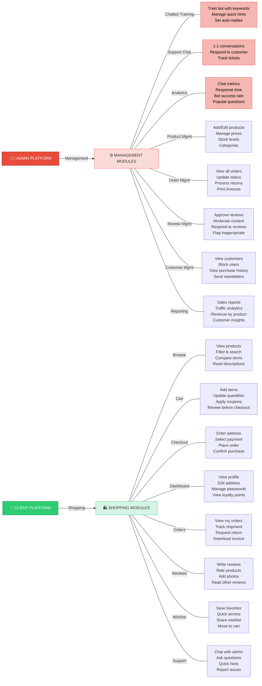

# 📊 Admin vs Client Platform Comparison

## 📋 Using this code:



---

## 🎯 Side-by-Side Comparison

| Feature | Admin Platform | Client Platform | Purpose |
|---------|---|---|---|
| **User Type** | Employee/Moderator | Customer/Guest | Role-based |
| **Access** | Protected routes | Public + Protected | Security |
| **Main Goal** | Manage business | Shop & buy | Different workflows |

---

## 👨‍💼 ADMIN PLATFORM (Management)

### 1️⃣ Chatbot Training
- ✅ Create training rules
- ✅ Manage keywords
- ✅ Set auto-replies
- ✅ Toggle active/inactive
- ✅ Delete obsolete rules

### 2️⃣ Support Chat
- ✅ View all conversations
- ✅ Respond to customers
- ✅ Track ticket status
- ✅ Manage support queue
- ✅ Close resolved tickets

### 3️⃣ Analytics Dashboard
- ✅ Chat metrics
- ✅ Response time tracking
- ✅ Bot success rate
- ✅ Popular questions
- ✅ Customer satisfaction

### 4️⃣ Product Management
- ✅ Add/Edit/Delete products
- ✅ Manage variants (size, color)
- ✅ Set prices & discounts
- ✅ Update stock levels
- ✅ Manage categories & brands

### 5️⃣ Order Management
- ✅ View all orders
- ✅ Update order status
- ✅ Print packing slips
- ✅ Process refunds
- ✅ Handle returns

### 6️⃣ Review Management
- ✅ Approve/Reject reviews
- ✅ Moderate content
- ✅ Respond to reviews
- ✅ Flag inappropriate content

### 7️⃣ Customer Management
- ✅ View customer base
- ✅ Block troublemakers
- ✅ Segment customers
- ✅ Send bulk email
- ✅ Track purchase history

### 8️⃣ Reporting & Analytics
- ✅ Sales reports
- ✅ Revenue analytics
- ✅ Traffic insights
- ✅ Product performance
- ✅ Customer lifetime value

---

## 👥 CLIENT PLATFORM (Shopping)

### 🛍️ 1️⃣ Browse & Search
- ✅ View all products
- ✅ Filter by category, price, brand
- ✅ Search functionality
- ✅ View product details
- ✅ See customer reviews

### 🛒 2️⃣ Cart Management
- ✅ Add items to cart
- ✅ Update quantities
- ✅ Remove items
- ✅ Apply coupon codes
- ✅ View total price

### 💳 3️⃣ Checkout
- ✅ Enter shipping address
- ✅ Select payment method
- ✅ Review order
- ✅ Place order
- ✅ Receive confirmation

### 💰 4️⃣ Payment
- ✅ Secure payment gateway (SePay)
- ✅ Multiple payment options
- ✅ Order confirmation email
- ✅ Automatic receipt

### 📦 5️⃣ Order Management
- ✅ View my orders
- ✅ Track shipment
- ✅ Download invoice
- ✅ Request return
- ✅ Check delivery status

### ⭐ 6️⃣ Reviews
- ✅ Write product reviews
- ✅ Rate 1-5 stars
- ✅ Add photos
- ✅ Submit for approval
- ✅ Read other reviews

### ❤️ 7️⃣ Wishlist
- ✅ Save favorite items
- ✅ Access anytime
- ✅ Add to cart from wishlist
- ✅ Share wishlist link

### 👤 8️⃣ Customer Dashboard
- ✅ View profile
- ✅ Edit address
- ✅ Change password
- ✅ View loyalty points
- ✅ Manage preferences

### 💬 9️⃣ Support Chat
- ✅ Ask questions
- ✅ Get quick FAQ answers
- ✅ Chat with admin
- ✅ Report issues

---

## 📊 Feature Comparison Table

| Feature | Admin | Client | Purpose |
|---------|:----:|:------:|---------|
| Manage products | ✅ | ❌ | Inventory control |
| Browse products | ❌ | ✅ | Shopping |
| Create rules (chatbot) | ✅ | ❌ | Train bot |
| Chat with support | ❌ | ✅ | Get help |
| View all orders | ✅ | ❌ | Business insight |
| View my orders | ❌ | ✅ | Track purchase |
| Approve reviews | ✅ | ❌ | Moderation |
| Write reviews | ❌ | ✅ | Share feedback |
| Manage customers | ✅ | ❌ | CRM |
| Edit my profile | ❌ | ✅ | Account management |
| View analytics | ✅ | ❌ | Business metrics |
| Download invoice | ❌ | ✅ | Record keeping |
| Apply coupons | ❌ | ✅ | Discounts |
| Create coupons | ✅ | ❌ | Marketing |

---

## 🔐 Access Control

### Admin Routes
```
/admin/*                Require: Admin authentication
Auth:                   Laravel 'web' guard
Methods:                GET, POST, PUT, DELETE
Middleware:             auth, admin
Database check:         User.role = 'admin'
```

### Client Routes
```
/shop/*                 Public access
/customer/*             Require: Customer authentication
/checkout/*             Require: Customer authentication
Auth:                   Laravel 'web' guard (customer)
Methods:                GET, POST
Middleware:             customer (optional), auth:customer
Database check:         Customer.status != 'blocked'
```

---

## 📈 Comparison: Where They Connect

```
┌─────────────────────────────────────────────────────┐
│            SHARED DATABASE (MySQL)                  │
├─────────────────────────────────────────────────────┤
│                                                     │
│ Products table                                      │
│  ↑ Admin creates   ↓ Client views                  │
│                                                     │
│ Orders table                                        │
│  ↑ Created by client ↓ Managed by admin            │
│                                                     │
│ Reviews table                                       │
│  ↑ Written by client ↓ Approved by admin           │
│                                                     │
│ Conversations table                                 │
│  ↑ Created by client ↓ Responded by admin          │
│                                                     │
└─────────────────────────────────────────────────────┘
```

---

## 🎯 User Journeys

### Admin Journey
```
Login → Dashboard → Select Module →
  ├─ Chatbot: Manage rules → Save → View Analytics
  ├─ Orders: View all → Update status → Process return
  ├─ Reviews: Approve → Respond → Publish
  └─ Chat: Read → Reply → Resolve
→ Logout
```

### Client Journey
```
Browse → Find product → Add to cart → Checkout →
Payment → Thank you page → View my orders →
Leave review → Track shipment → Dashboard →
Edit profile → Wishlist → Chat support → Logout
```

---

## 📊 Data Flow Diagram

```
ADMIN                          CLIENT
  │                              │
  ├─ Upload products    →←─ Browse products
  │                              │
  ├─ Set prices         →←─ Add to cart
  │                              │
  ├─ Manage stock       →←─ Place order
  │                              │
  ├─ Create coupons     →←─ Apply coupon
  │                              │
  ├─ View orders        ←─ Customer purchases
  │                              │
  ├─ Approve reviews    ←─ Customer writes review
  │                              │
  ├─ Respond to chat    ←─ Customer chat
  │                              │
  └─ Generate reports   ← All customer data
```

---

## 🎨 Frontend/Backend Requirements

### Admin Dashboard Requires:
- Authentication system
- Role-based access control
- Database models (Product, Order, Review, etc.)
- Admin views/templates
- Admin controllers
- Admin routes
- Admin middleware

### Client Platform Requires:
- Authentication system
- Product catalog
- Shopping cart (session/database)
- Payment gateway integration
- Order management
- Customer profile
- Review system
- Chat widget
- Client views/templates
- Client controllers
- Client routes

---

## 🚀 Implementation Priority

### Phase 1: Core (What you have)
- ✅ Product browsing
- ✅ Cart management
- ✅ Checkout & payment
- ✅ Orders
- ✅ Chat system

### Phase 2: Enhancement
- ✅ Reviews & ratings
- ✅ Wishlist
- ✅ Customer dashboard
- ✅ Profile management

### Phase 3: Advanced
- ⏳ Returns & refunds
- ⏳ Loyalty points
- ⏳ Referral rewards
- ⏳ Advanced analytics

### Admin Phase 1: Core
- ✅ Product management
- ✅ Order management
- ✅ Chatbot training
- ✅ Support chat

### Admin Phase 2: Enhancement
- ✅ Review moderation
- ✅ Customer management
- ✅ Analytics dashboard
- ✅ Report generation

---

## 📝 Summary

**Admin Platform** = **Back-office management**
- Manage the business
- Control data
- Respond to customers
- View metrics

**Client Platform** = **Front-end shopping**
- Browse & buy
- Manage personal account
- Track orders
- Get support

Both connect through a **shared database** and **chat system**!

